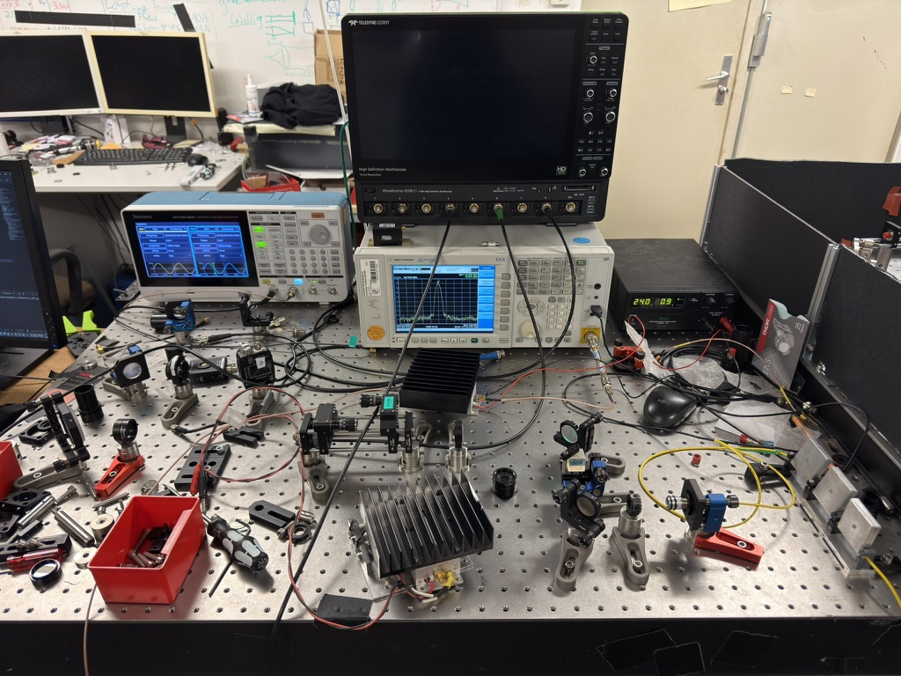
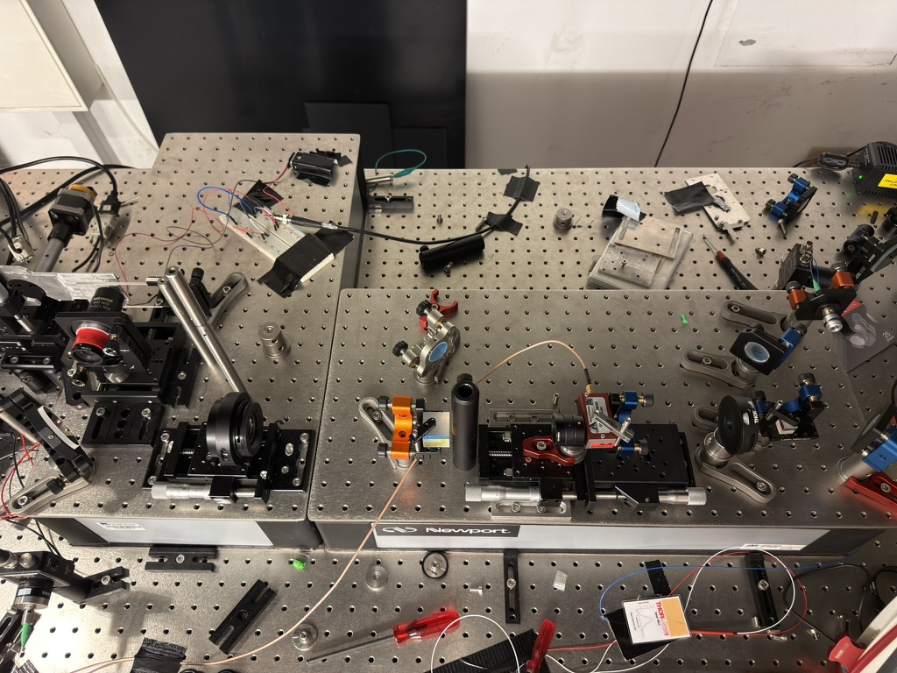
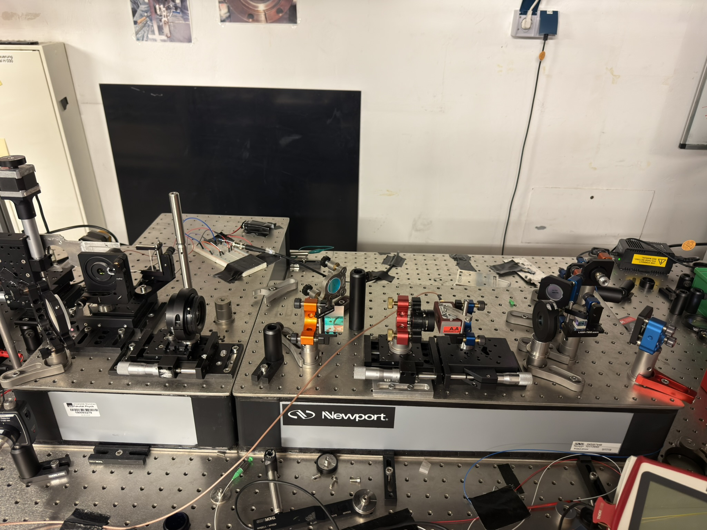

# Arbeitszeit-Logbuch

| Datum      | Start | Ende  | Kategorie     | Beschreibung                               |
| :---       | :---  | :---  | :---          | :---                                       |
| 2026-07-06 | 14:00 | 16:50 | Hardware      | Anfang Testaufbau, AOD auf Mikrometertisch schrauben mit der richtigen Höhe        |
| 2026-07-07 | 11:10 | 12:40 | Hardware      | Überlegung weiteres Vorgehen beim Setup        |
| 2026-07-07 | 13:40 | 17:20 | Hardware      | Längeres SMA Kabel für Verbindung zwischen RF Amplifier und AOD, Lambda Halbe Platte vor AOD ausgetauscht (jetzt für 850 nm geeignet);  Bene hat die 25.4 mm Linse in ein schraubbares Linsengehäuse eingebaut;  Problem bei der AOD Justage: Der Strahl nach dem AOD wird eben abgelenkt und demensprechend die Linse danach nicht entlang der optischen Achse positioniert werden kann. Die optischen Achsen sind eben durch die Schraubenlöcher des Breadboard vorgegeben, da nur dort die Translationsmikrometerverschiebetische befestigt werden können. Wir dürfen also mit keinem Winkel in die Linse eintreten, der von der optischen Achse abweicht.        |
| 2026-07-08 | 10:00 | 11:20 | Aufräumen      | Aufräumen des Tisches, den Bene für seine Bachelorarbeit verwendet hat, um Platz für das zweite Breadboard zu haben.         |
| 2026-07-08 | 14:00 | 17:25 | Hardware      | Einbau des zweiten Breadboards; Befestigung mit Metallabstandshaltern.  Positionierung der zweiten Linse auf das neue Breadboard -> Mikrometertisch montieren, AOD und erste Linse jeweils auf ihren Mikrometertischen auf dem ersten Breadboard festschrauben. Nach Kollimatorlinse jetzt ein Spiegel, dann Beam Splitter und dann zweiter Spiegel, Lambda-Halbe-Platte (850 nm), AOD, 1. Linse, 2. Linse, Spiegel, Objektiv, Glasplatte.  Das schwierige an dem Einbau des AOD ist, dass wir der Winkel des einfallenden Strahls genau so eingestellt werden muss, dass der Strahl danach genau durch die beiden Linsen auf einer optischen Achse verläuft.         |
| 2026-07-09 | 11:10 | 12:20 | Hardware      | AOD neu justieren        |
| 2026-07-09 | 13:20 | 17:10 | Hardware      | Beamsplitter (PBS) zwischen Spiegel und Lambda Halbe Platte gepackt, umgelenkt mit zwei Spiegeln zu großem Non polarizing Beam Splitter vor der großen Linse -> das ist der kleine Strahl, den Bene dann verwendet hat, um das Objektiv zu justieren, da der Strahl nach dem Passieren der zweiten Linse stark vergrößert ist und damit nicht mehr präzise justiert werden kann. Man könnte auch die Linsen einfach rausschrauben, was bei Bene nicht ging, da er die kleine Linse noch nicht in eine schraubbare Halterung gebaut hat, sondern die war eben in einem Halter, den man in den Sockel reindrehen muss und somit beim Rausdrehen zwangsläufig die Ausrichtung also den Winkel zum Strahl beim Wiederhereindrehen verändern könnte, was das Alignment etwas zerstört. Bei uns könnten wir auch die Linsen herausschrauben und auf den extra Pfad verzichten; Beim Herausschrauben und Wiederhereinschrauben könnten natürlich minimale Verschiebungen der ursprünglichen Positionen auftreten, diese sollten bei vorsichtigem Vorgehen aber eigentlich nicht allzu groß sein, da der Mikrometertisch festgeschraubt ist auf dem Breadboard und die Schraube für die Position bzw. eher die Feder, die den Schlitten hält, sich nicht so leicht verändert.   Ich habe dann natürlich wieder den AOD neu justiert mit den zwei Umlenkspiegeln davor. Erst als der Strahl dann perfekt durch die Irisblenden an Stelle der Linsen ging, haben wir die Beam Splitter eingesetzt, sodass das Signal maximal ist.   Das Objektiv haben wir auch noch justiert, indem wir den kleinen Strahl mit einem Umlenkspiegel auf den Spiegel vor dem Objektiv ins Zentrum justiert haben und dann mit dem Spiegel auf dem Objektiv den Laser auf den Umlenkspiegel in den Punkt des eintreffenden Strahl justiert haben. Dann kann man mit dem Umlenkspiegel den Strahl auf die gleiche Position des einkommenden Strahls bei der Linse justieren, sodass die auch noch perfekt überlappen. So erreicht man dann die Rückkopplung und kann mit Beamwalking des Objektivspiegels und des Umlenkspiegels feinjustieren.   Bei der Justage der Glasplatte, wie Bene es in seiner Arbeit gemacht hat, hatten wir jedoch das Problem, dass die durch die Glasplatte reflektierten Interferenzringe auf der Kamera nur sehr schwach waren und auch keine Unebenheiten zeigten. Eigentlich sollte man zwei unterschiedliche konzentrische Wellenpakete sehen, die sich eben nicht perfekt überlagern und je nach Art der Überlagerung kann man dann den Winkel der Glasplatte justieren, bis die Ringe wirklich genau übereinander liegen. Doch egal wie der Winkel war, die sehr schwachen Ringe zeigten keine Abweichungen.  Wir müssen also herausfinden, wieso die Methode aktuell nicht funktioniert. Wir dachten, dass es vielleicht an der zu geringen Leistung liegt, dass man fast nichts sieht. Also habe ich die Kopplung noch etwas optimiert von dem Breadboard der 852 nm Laserquelle aus in die Glasfaser. Dabei konnte ich aber nur minimal die bei einem Beam Splitter gemessene Leistung von ca. 3.4 auf 3.6 mW erhöhen. Die Leistung der Laserquelle darf auch nicht viel höher gestellt werden, aktuell stellen wir sie immer auf 0.167. Der AOM zur schnellen Leistungsanpassung blockiert auch nichts.      |
| 2026-07-13 | 10:00 | 11:10 | Hardware      | Überlegen, wie wir die Glasplatte besser justieren können und ob der kleine Strahl über die zwei Strahlteiler wirklich notwendig ist. Man könnte natürlich einfach die Linsen herausdrehen und dann direkt den Strahl nehmen, um das Objektiv zu justieren. Beim erneuten Reindrehen und auch beim Herausdrehen können aber wieder relativ schnell Alignment Fehler auftreten; das Vorgehen hätte aber den Vorteil, dass wir mehr Intensität beim Laser hätten. Den ersten Strahlteiler müssten wir allerdings so oder so behalten, weil er die lineare Polarisation für den AOD herausfiltert. Wir hatten auch noch das Problem, dass die Kamera immer nur mit Glück von der UI cockpit Software erkannt wurde, weil der Pixelclock anscheinend zu hoch war. Wir haben ein anderes Kamera-Kabel gefunden, bei welchem es dieses Problem nicht gab; die Kamera hat direkt ein Bild geliefert.  (Ich habe auch erst ein Python Script geschrieben, um die Kamera per pyueye aufzurufen und dort direkt den Pixelclock herunterzuschrauben, aber das Bild war nur schwarz.)      |
| 2026-07-13 | 13:50 | 17:50 | Hardware      | Wir haben Florian die Situation erklärt und anstatt den Beam Splitter und damit den kleinen Justagestrahl zu entfernen, haben wir die Leistung erhöht, die aus der Glasfaser kommt, indem Florian einerseits den Laser auf die maximale Leistung aufgedreht hat auf 0.261 und einen Polarisator zwischen Laserquelle und Koppler eingestellt hat. Wir haben für die maximale Leistung auch direkt den 50/50 Glasfaser Splitter ausgebaut. Ich habe dann wieder reingekoppelt, weil es zu leichten Verschiebungen kam, nachdem man die Glasfaser rein- und raussteckt in den Koppler. Wir haben bei dem Ende der Glasfaser um die 34 mW gemessen. Da das aber eigentlich schon zu viel ist und eben auch relativ gefährlich, falls man mal doch reinguckt, haben wir den Glasfaser Strahlteiler wieder eingebaut und kommen dann auf ca. 16 mW. So habe ich auch noch den Laser für meine späteren Rearranging Messungen.   Leider funktioniert das Glasplatten Alignment immer noch nicht so wie es sollte. Die Ringe sind immer noch nicht so gut sichtbar und werden vor allem überstrahlt von einer starken Körnung. Die konnte etwas reduziert werden, indem Florian den Beam Splitter bestehend aus zwei Glasplatten mithilfe einer Stangenkonstruktion umgedreht hat und dann noch die Kamera an der Stange befestigt hat, sodass der Abstand zwischen Beamplitter und Kamera möglichst klein ist. Aber wirklich justieren kann man mit dem Bild immer noch nicht.   Da Bene in seiner Arbeit den 780 nm Laser für das Alignment verwendet hat und nicht den 852 nm wie wir bisher, haben wir den Laser jetzt auch mal gewechselt und tatsächlich sehen wir die Streifen der Interferenzring-Überlagerung besser und haben darauf basierend die Glasplatte justiert.  Danach haben wir den Laser wieder auf 852 nm gewechselt und Bene hat die Knife-Edge-Messung durchgeführt. Wir erreichen ca. das Diffraction Limit, also sind bei so ca. 880 nm bei der y-Achse und bei der x-Achse sogar darunter bei irgendwas mit 700+ nm. Bei der x-Messung war das Strahlprofil auch etwas asymmetrisch, was auf Koma hindeutet und dementsprechend vor allem auf eine doch nicht so gut eingestellte Glasplatte.       |
| 2026-07-14 | 10:30 | 12:10 | Software      | Bene führt erneut eine Knife-Edge-Messung durch und ich überlege mir, wie man mein Setup zum Testen des Rearrangements, welches ich im nächsten Schritt aufbauen soll, ansteuern kann. Das Problem ist schließlich, dass die Karte einerseits die statischen Strahlen erzeugen soll bei dem Optical Tweezers Aufbau und andererseits für mein Test Setup die Strahlen erzeugen soll. Ich habe deshalb zunächst versucht, ein Programm zu schreiben, was für beide Ausgänge die gewünschten Signale gleichzeitig ausgibt.        |
| 2026-07-14 | 13:20 | 19:10 | Software      | Ich nehme jetzt auf Florians Rat hin den AFG, um die statischen Strahlen zu erzeugen für den Optical Tweezers Aufbau. Das richtig einzurichten hat sich als deutlich schwieriger herausgestellt als zunächst gedacht. Als erstes musste ich die Kommunikation zwischen dem PC und dem AFG einrichten (USB-Kabel verbindet PC und AFG); pyvisa hat irgendwie nicht richtig funktioniert und ich musste auf eine andere Python Library zur USB Ansteuerung wechseln (/dev/usbtmc*).  Dann habe ich erstmal die Kalibrierung des AFG durchgeführt. Also habe ich den RF-Amplifier an den AFG angeschlossen und den Output des Amplifiers dann wieder an die Dämpfungsglieder vor dem Spectrum Analyzer, und für alle Frequenzen in 1 MHz Schritten von 30 bis 90 MHz von 1 bis 680 mV Spannungsamplituden gemessen. So kam ich ca. auf die maximal möglichen 2 Watt des AODs, den wir damit betreiben.  Die Werte der Messreihe kommen alle in eine .csv Datei und dienen von nun an als Kalibrationsmatrix, um die richtigen Spannungsamplituden den gewünschten Leistungen zu ordnen zu können. Bei der Generierung der Signale für das AFG wollte ich zunächst feste Dateien erstellen und diese dann auf den AFG laden. Das ermöglicht aber natürlich nicht, dass man schnell verschiedene Frequenzen und Leistungen testen kann, weil man jedes Mal die Datei erzeugen muss (.csv bzw. .tfw) und über einen USB-Stick auf den AFG laden muss. Außerdem muss man am AFG auch noch für jede Datei die Frequenz einstellen und die Leistungsamplitude, mit der die Datei wiedergegeben werden soll. Diese Werte sind immer verschieden, lassen sich aber natürlich im Python Programm, das die Datei erstellt, mit berechnen und ausgeben. Nichtsdestotrotz ist der Ansatz der automatischen Ansteuerung deutlich praktischer und einfacher. Ich habe ein Programm geschrieben, was dann einfach immer den AFG mit dem richtigen Signal füttert, um die gewünschten Frequenzen und Leistungen zu erzeugen. Allerdings gab es das Problem, dass bei dem Signal am Spectrum Analyzer bei z.B. dem überlagerten Signal von 60 und 75 MHz einen größeren Peak bei 90 MHz gab als der bei 60 MHz hoch war. Das ist unphysikalisch und kann nicht sein. Eine Intermodulationsfrequenz kann keine höhere Leistung haben als die ursprünglichen Frequenzen. Auch bei niedrigerer Leistung blieb das Verhältnis gleich, was Intermodulationsfrequenzen ausschließt und auf ein falsches Signal hindeutet.       |
| 2026-07-15 | 13:50 | 17:15 | Software & Hardware      | Ich habe den Fehler gefunden mit der Hilfe von Gemini; Das Problem war, dass die Signale mit signed bits erstellt wurden, aber der AFG funktioniert mit unsigned bits, also das Minimum der Spannungskurve liegt bei 0 statt -8192. Das ist fundamental verschieden von der Spectrum Card, die eben mit signed bits funktioniert. Als ich das im Code geändert habe für den AFG, konnte ich auch wieder perfekte Peaks bei nur den gewünschten Frequenzen sehen. Die Frequenz Peaks sind zudem sichtbar definierter als bei der Spectrum Card und deuten somit auf ein reineres Signal hin, was Sinn macht, da das AFG zum Beispiel ein eigenes Gehäuse hat, dass Störungen besser dämpft als eine in einen PC eingebaute PCIe Card.  Der Amplifier, den mir Florian gegeben hatte, hat leider nicht funktioniert und das Netzteil, mit dem ich ihn betreiben sollte, hat nicht genug Spannung geliefert. Also hat er mir noch einen neuen Amplifier und eine neue Power Supply besorgt. Damit konnte ich den Amplifier betreiben und habe eine Kalibrationsmatrix aufgenommen für den neuen Amplifer mit der Spectrum Card, um diese später für meine Steuerung im Rearranging Setup verwenden zu können.  Derweil hat Florian auch festgestellt, wie wir bereits zuvor, dass die größere Linse unseres Optical Tweezers Setups leicht gekippt ist, weil der Halter es eben nicht anders zulässt. Es gibt jedoch noch einen anderen Halter für diese großen 2 Zoll Linsen, die wir verwenden sollen. Da passt das Gewinde jedoch noch nicht, also waren Florian und Bene in der Werkstatt und haben ein Gewinde gebohrt.          |
| 2026-07-16 | 10:20 | 12:10 | Hardware      | Ich habe den AOD wieder durch die beiden Linse neu justiert und bei der Justage für das Objektiv ist uns aufgefallen, dass der Strahl einen starken Winkel hat und nicht parallel durch die Linsen geht. Wir müssen also alles an die Höhe der großen Linse anpassen, die jetzt eben gerade steht aufgrund der neuen Halterung aber auch höher.         |
| 2026-07-16 | 13:30 | 17:10 | Hardware      | Wir haben also die Höhe von allen Bauteilen erhöht mit zusätzlichen Spacern. Die Höhe der Mitte der großen Linse lag bei ca. 8.1 cm über dem optischen Tisch und an diesem Wert haben wir uns nun für die Höhe orientiert, sodass der Strahl möglichst geringfügig abgelenkt wird in seiner Höhenposition.  Es ergab sich leider wieder ein spürbarer Winkel des Strahls bei der Objektiv Justage. Man konnte gut erkennen, dass nach dem Einsetzen der kleinen stark gekrümmten Linse (f = 1 inch = 25.4 mm), der Strahl nicht mehr die Mitte der zweiten Linse trifft. Das bedeutet, dass die Justage durch die Irisblenden nicht sonderlich hilfreich ist für den tatsächlichen Aufbau mit den Linsen. Also müssen wir mit den beiden Linsen und den Irisblenden den Strahl justieren. Das Problem ist nur, dass bei der kleinen Linse aufgrund des sehr geringen Abstands zu dem AOD (wegen 4f-System f = 1 Zoll) keine Iriblende mehr reinpasst. Stattdessen haben wir also die Linse falsch herum in die runde, schraubbare Halterung eingebaut und konnten jetzt den Halter umdrehen und eine Irisblende hinzufügen, wobei die gekrümmte Seite immer noch zuerst im Strahlengang ist. Es könnte sein, dass der Abstand, der nötig ist, noch etwas geringer sein muss, als wir ihn jetzt per Augenmaß und Messen eingestellt haben und dann stößt der Linsenhalter gegen den AOD und wir können nicht näher kommen. Uns fiel aber leider keine bessere Idee ein und deswegen belassen wir es jetzt erst einmal dabei.  Ich habe dann den Strahl wieder durch die geschlossenen Irisblenden navigiert und auf das Maximum justiert, dabei verwenden wir jetzt aber nur noch einen Umlenkspiegel und direkt die Halterung des Faserkopplers. Der zweite Umlenkspiegel wurde im Zuge des Neuaufbaus entfernt. Wir haben auch noch den Abstand zwischen den beiden Linsen justiert, indem wir den Laser nach der zweiten Linse mit einem Spiegel zurückgekoppelt haben (Autokollimation). Den Spiegel dabei richtig einzustellen hat etwas gedauert, aber wir haben es letztlich hinbekommen. Dann haben wir die zweite Linse auf dem Mikrometertisch solange verstellt bis bei jeweils optimierter Spiegelausrichtung das globale Maximum erreicht wurde, wobei die Schwankungen und die Sensitivität sehr hoch waren.          |
| 2026-07-22 | 9:50 | 12:10 | Hardware      | Wir müssen doch erst den Strahl nach dem AOD durch die Irisblenden an den beiden Linsen justieren und dann die erste Linse einbauen. So wird sichergestellt, dass der Strahl die Linse auch wirklich mittig trifft und ohne Winkel. Dafür haben wir die Linse in einen Halter mit Mikrometerschrauben nach einer Irisblende gedreht, sobald der Strahl nach dem AOD durch die beiden geschlossenen Linsen an den Irisblenden justiert wurde. Durch die Mikrometerschrauben wird die Linse nun so gedreht, dass der Strahl wieder perfekt durch die geschlossenen Irisblenden geht. Es wird dabei immer so gedreht bis die Leistun, gemessen mit dem Powermeter nach der zweiten Linse, maximal ist. Durch das Verstellen des Winkels mit den Mikrometerschrauben ändert sich auch wieder der Winkel der Irisblende. Um also den Strahl mittig ohne Winkel durch die erste Linse zu führen, muss diese wieder entfernt werden und erneut der Strahl durch die beiden geschlossenen Linsen navigiert werden. Dann kann wieder die Linse eingebaut werden und der Winkel mit den Mikrometerschrauben angepasst werden, ... Das wird dann iterativ durchgeführt bis der Strahl perfekt durchgeht mit und ohne erste Linse. Die zweite Linse können wir leider nicht ausbauen, da sie fest in den Halter geschraubt wurde, um mehr Stabilität zu gewährleisten im Vergleich zum Draufschrauben auf einen hohlen Halter. In diesem Fall würde die Linse schließlich leicht nach vorne kippen. Wir können also bei der zweiten Linse nicht dieses iterative Verfahren anwenden, sondern nur die geschlossene Blende vor der fest eingebauten Linse verwenden.   |
| 2026-07-22 | 13:00 | 17:20 | Hardware      | Beim Justieren des Strahls auf das Objektiv fiel uns auf, dass der Strahl selbst bei einem völlig nach oben geneigten Spiegel nicht ins das Objektiv geht. Das bedeutet, dass der Strahl durch die beiden Linsen nicht parallel verläuft sondern nach unten verkippt ist. Die zweite Linse ist folglich zu niedrig. Eine erneute Messung der Höhe mit dem Lineal bestätigt das. Davor haben wir vermeintlich 8.1 cm gemessen und jetzt ca. 7.8 cm. Das Problem ist eben, dass man sogenannte Parallaxenfehler beim Ablesen des Lineals macht und jetzt der Wert so bestimmt wurde, dass wir bei der geschlossenen Irisblende mit einem Gegenstand auf das Lineal gehen und so Ablesefehler reduzieren. Wir haben dann dementsprechend die Position der Linse um 3 mm erhöht mit einem Spacer. Jetzt geht der Strahl mit einem deutlich geringeren Winkel des Spiegels in das Objektiv. Wir haben also die Ablenkung minimiert.  Natürlich haben wir dann auch noch den Abstand zwischen den beiden Linsen justiert, indem wir mit einem Spiegel den Strahl zurückgekoppelt haben und eben bei der zweiten Linse den Abstand mit dem Mikrometertisch eingestellt haben. Dabei haben wir wieder das globale Maximum gefunden. Die Justage war extrem sensibel und man musste die Schrauben extrem fein drehen.  Wir haben dann noch das Objektiv über die Rückkopplung justiert und die Glasplatte über die Kamera mit dem 780 nm Laser. Die Glasplatte hat Bene auch fest geschraubt auf dem Mikrometertisch, damit beim Verschieben des Objektivs wenigstens der Abstand zwischen der Glasplatte und dem Objektiv konstant bleibt.         |
| 2026-07-23 | 10:10 | 12:20 | Hardware      | Bene hat den Strahl vermessen. Ich habe mit dem Einrichten des Rearrangement Setups angefangen. Zunächst habe ich aber noch die Messdaten der Kalibrierungsmatrizen für den neuen Verstärker geplottet. Dann habe ich das Setup umgebaut und verwende jetzt statt dem AFG für die Trigger Signale der Pulse nur die Spectrum Card, die eben neben dem Signal, das sie selbst für die Steuerung des AODs ausgibt auch den Trigger über CH1 ausgibt an das Oszilloskop. Dieses ist wie mit dem AFG eine Rechteckspannung bei 1 kHz.        |
| 2026-07-23 | 13:30 | 16:45 | Hardware      | Ich habe dann auch wieder den AOD eingebaut in das Setup meiner Bachelorarbeit. Ich habe dabei zunächst den Strahl nochmal minimal nachjustiert durch zwei geschlossene Irisblenden, eine auf dem Linsenhalter vor dem Cage, die andere hinter dem Cage, vom Strahlenverlauf aus gesehen. Dann habe ich noch einen Halter wie bei dem anderen AOD gefunden und den AOD eingebaut. Die richtigen Winkel habe ich dann mit dem nach vielem Herumprobieren funktionierenden Python Skript eingestellt, sodass die Pulse alle ca. die gleiche Amplitude haben und eben so hoch wie möglich sind. Wobei ich mir dabei noch nicht ganz sicher bin, ob ich sie wirklich komplett richtig eingestellt habe; Schließlich erscheint zum Beispiel bei der Mittenfrequenz die nullte Ordnung gleich hell wie die erste und es gibt einige Nebenmaxima, die zumindest im Dunkeln sichtbar sind.  Bene und ich haben uns dann auch noch überlegt, wie genau wir den Abstand zwischen der zweiten Linse und dem Objekt richtig einstellen. Wir wollten erst mit zwei Strahlen am Rand der Bandbreite den Abstand einstellen, indem wir den Mikrometertisch verschieben mit der Schraube, bis das Maximum der Leistung durch die geschlossene Irisblende in der Mitte des Objektivs erreicht wird. Das Interessante war jedoch, dass der Wert gestiegen ist, als wir in die falsche Richtung gedreht haben, also der Abstand, der bereits deutlich zu gering war (bestimmt um 3 cm), wurde noch kleiner als die eigentlichen 30 cm. Das lässt sich dadurch erklären, dass der Strahl der Mittenfrequenz, auf den alles justiert wird, nicht perfekt entlang der Achse, auf der der Mikrometertisch verschoben wird, liegt. Man müsste also bei jeder neuen verschobenen Position wieder den Strahl per Rückkopplung in das Objektiv parallel zentrieren. Da wir nur einen Umlenkspiegel haben, müssen wir aktuell immer auch das Objektiv selbst mit dem draufschraubbaren Spiegel für die Rückkopplung verwenden. Das sorgt dann aber auch dafür, dass wir wieder die Glasplatte justieren müssen, da sich dann ja der Winkel zwischend den beiden Bauteilen ändert. Das ist sehr aufwendig, da wir dafür zum Beispiel auch den Laser wechseln müssen und die Justage mit der Kamera nicht wirklich aussagekräftig ist, sodass wir Messungen mit der Photodiode machen müssen, um das Strahlprofil charakterisieren zu können und dementsprechend die Glasplatte justieren. Das Glasplatten Alignment lässt sich vermeiden, wenn wir noch einen Umlenkspiegel hinzufügen vor dem Objektiv, da wir dann genügend Freiheitsgrade haben. Das ist allerdings knapp mit den uns nur zur Verfügung stehenden 30 cm aufgrund der Brennweite der zweiten Linse. Es geht aber eventuell, wenn wir eben die Spiegel recht nah beieinander hinstellen und den Strahl etwas zickzack-förmig ablenken in das Objektiv. Dieses muss dann aber um 90 Grad rotiert werden. Aktuell geht das nicht, weil das Knife-Edge-Gerät zum Strahlvermessen am Rand stehen muss von unserem erhöhten optischen Tisch und dadurch die Glasplatte ganz am Rand stehen muss. Dann haben wir aber keinen Platz, um den Mikrometertisch festzuklemmen. Das würde gehen, wenn wir jedoch noch eine Befestigungsplatte hätten oder eventuell die der zweiten Linse nehmen...          |
| 2026-09-09 | 11:30 | 12:00 | Hardware      | Wir haben uns wieder mit dem Aufbau vertraut gemacht und überlegt, wie wir den umbauen können, um den Laser auf das Objektiv mit zwei Umlenkspiegeln statt einem lenken zu können und dadurch nicht mehr das Objektiv justieren zu müssen. Wir haben erst überlegt direkt den ganzen Aufbau auf nur einen von den beiden Tischen zu komprimieren. Das Problem ist, dass die beiden verwendeten Tische nicht breit genug sind, um die Bauteile auf einem einzelnen Tisch aneinander zu reihen und vor allem ist der kleine Strahl im Weg. |
| 2026-09-09 | 13:00 | 15:40 | Hardware      | Beim Einbau von beiden Umlenkspiegeln muss das Objektiv um 90 Grad gedreht eingebaut werden und dafür brauchen wir aus Platzgründen eine Platte zum Befestigen des Mikrometertisches des Objektivs auf den optischen Tisch. Da wir keine zusätzliche Platte gefunden haben, haben wir uns entschieden, die der ersten Linse zu verwenden und somit eben die erste Linse einfach ohne Mikrometertisch starr zu positionieren. Diese musste dann wieder so in den Strahlengang gesetzt werden, dass der Strahl durch den Linsen-Halter bei geschlossener Blende ohne Linse die maximale Leistung am Powermeter hinter der zweiten Linse erzeugt und möglichst senkrecht zur optischen Achse steht. Dann wird die Linse wieder reingeschraubt und die Yaw und Tilt Schrauben des Linsenhalters gedreht, sodass das Signal am Powermeter wieder maximal ist. Dann wird wieder die Linse entfernt und der Strahl mit den beiden Umlenkspiegeln vor dem AOD so justiert, dass durch die beiden geschlossenen Irisblenden bei den Linsen das Signal dahinter am Powermeter maximiert wird. Das wird iterativ gemacht. An den Yaw und Tilt Schrauben des AODs muss auch gedreht werden, um das Signal zu maximieren.  |
| 2026-09-10 | 10:30 | 12:10 | Hardware      | Überlegung weiteres Vorgehen beim Setup        |
| 2026-09-10 | 13:10 | 21:15 | Hardware      | Überlegung weiteres Vorgehen beim Setup        |