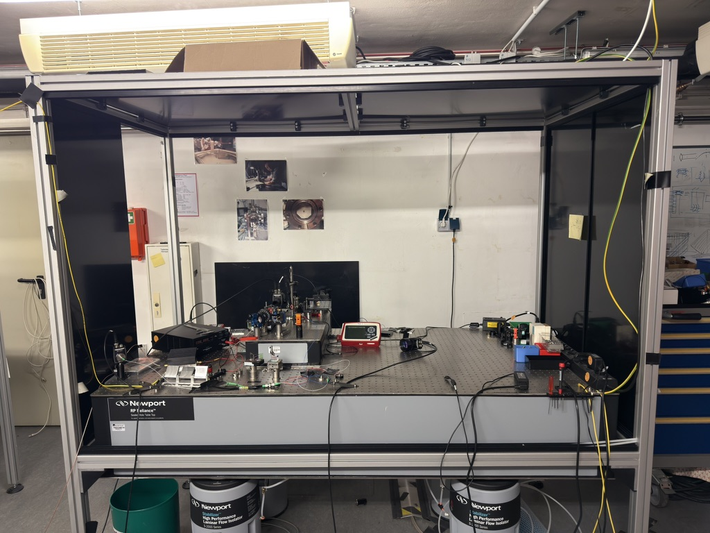
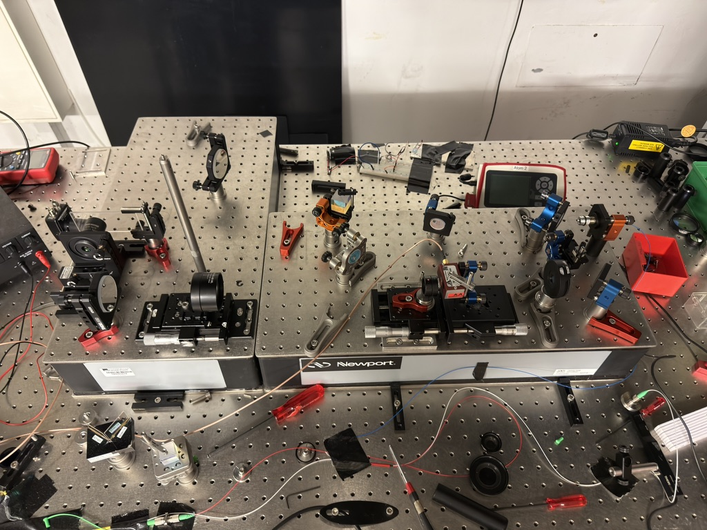
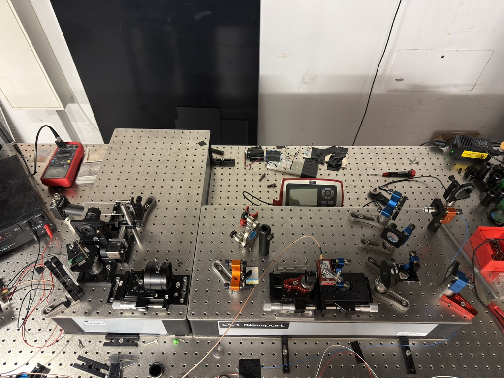

# Arbeitszeit-Logbuch

| Datum      | Start | Ende  | Kategorie     | Beschreibung                               |
| :---       | :---  | :---  | :---          | :---                                       |
| 2026-07-06 | 14:00 | 16:50 | Hardware      | Anfang Testaufbau, AOD auf Mikrometertisch schrauben mit der richtigen Höhe        |
| 2026-07-07 | 11:10 | 12:40 | Hardware      | Überlegung weiteres Vorgehen beim Setup        |
| 2026-07-07 | 13:40 | 17:20 | Hardware      | Längeres SMA Kabel für Verbindung zwischen RF Amplifier und AOD, Lambda Halbe Platte vor AOD ausgetauscht (jetzt für 850 nm geeignet);  Bene hat die 25.4 mm Linse in ein schraubbares Linsengehäuse eingebaut;  Problem bei der AOD Justage: Der Strahl nach dem AOD wird eben abgelenkt und demensprechend die Linse danach nicht entlang der optischen Achse positioniert werden kann. Die optischen Achsen sind eben durch die Schraubenlöcher des Breadboard vorgegeben, da nur dort die Translationsmikrometerverschiebetische befestigt werden können. Wir dürfen also mit keinem Winkel in die Linse eintreten, der von der optischen Achse abweicht.        |
| 2026-07-08 | 10:00 | 11:20 | Aufräumen      | Aufräumen des Tisches, den Bene für seine Bachelorarbeit verwendet hat, um Platz für das zweite Breadboard zu haben.         |
| 2026-07-08 | 14:00 | 17:25 | Hardware      | Einbau des zweiten Breadboards; Befestigung mit Metallabstandshaltern.  Positionierung der zweiten Linse auf das neue Breadboard -> Mikrometertisch montieren, AOD und erste Linse jeweils auf ihren Mikrometertischen auf dem ersten Breadboard festschrauben. Nach Kollimatorlinse jetzt ein Spiegel, dann Beam Splitter und dann zweiter Spiegel, Lambda-Halbe-Platte (850 nm), AOD, 1. Linse, 2. Linse, Spiegel, Objektiv, Glasplatte.  Das schwierige an dem Einbau des AOD ist, dass wir der Winkel des einfallenden Strahls genau so eingestellt werden muss, dass der Strahl danach genau durch die beiden Linsen auf einer optischen Achse verläuft.         |
| 2026-07-09 | 11:10 | 12:20 | Hardware      | AOD neu justieren        |
| 2026-07-09 | 13:20 | 17:10 | Hardware      | Beamsplitter (PBS) zwischen Spiegel und Lambda Halbe Platte gepackt, umgelenkt mit zwei Spiegeln zu großem Non polarizing Beam Splitter vor der großen Linse -> das ist der kleine Strahl, den Bene dann verwendet hat, um das Objektiv zu justieren, da der Strahl nach dem Passieren der zweiten Linse stark vergrößert ist und damit nicht mehr präzise justiert werden kann. Man könnte auch die Linsen einfach rausschrauben, was bei Bene nicht ging, da er die kleine Linse noch nicht in eine schraubbare Halterung gebaut hat, sondern die war eben in einem Halter, den man in den Sockel reindrehen muss und somit beim Rausdrehen zwangsläufig die Ausrichtung also den Winkel zum Strahl beim Wiederhereindrehen verändern könnte, was das Alignment etwas zerstört. Bei uns könnten wir auch die Linsen herausschrauben und auf den extra Pfad verzichten; Beim Herausschrauben und Wiederhereinschrauben könnten natürlich minimale Verschiebungen der ursprünglichen Positionen auftreten, diese sollten bei vorsichtigem Vorgehen aber eigentlich nicht allzu groß sein, da der Mikrometertisch festgeschraubt ist auf dem Breadboard und die Schraube für die Position bzw. eher die Feder, die den Schlitten hält, sich nicht so leicht verändert.   Ich habe dann natürlich wieder den AOD neu justiert mit den zwei Umlenkspiegeln davor. Erst als der Strahl dann perfekt durch die Irisblenden an Stelle der Linsen ging, haben wir die Beam Splitter eingesetzt, sodass das Signal maximal ist.   Das Objektiv haben wir auch noch justiert, indem wir den kleinen Strahl mit einem Umlenkspiegel auf den Spiegel vor dem Objektiv ins Zentrum justiert haben und dann mit dem Spiegel auf dem Objektiv den Laser auf den Umlenkspiegel in den Punkt des eintreffenden Strahl justiert haben. Dann kann man mit dem Umlenkspiegel den Strahl auf die gleiche Position des einkommenden Strahls bei der Linse justieren, sodass die auch noch perfekt überlappen. So erreicht man dann die Rückkopplung und kann mit Beamwalking des Objektivspiegels und des Umlenkspiegels feinjustieren.      |